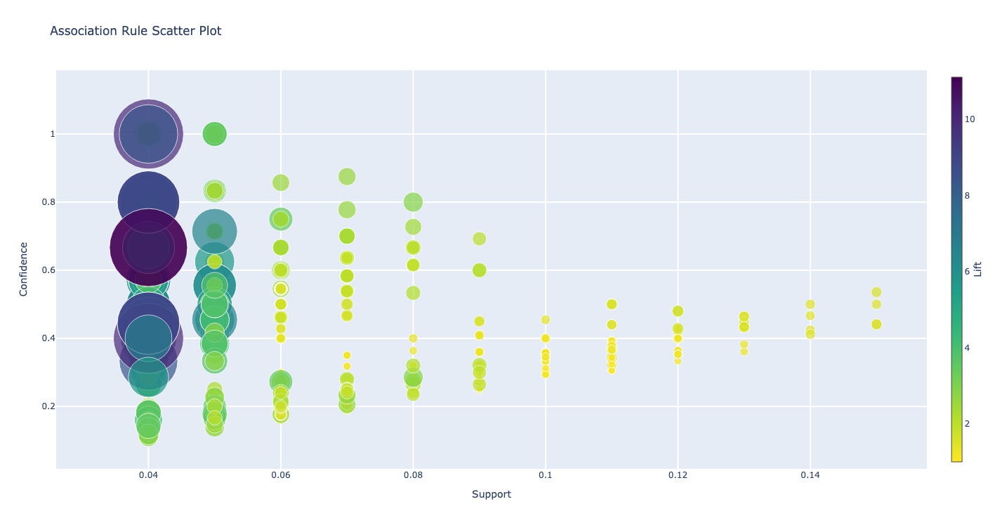

# Recommendation-system-using-web-usage-mining

This project is a recommendation system for an e-commerce website that uses web usage mining techniques to analyze user behavior and suggest relevant products to users. The system includes several components, including a data generator, data cleaner, data analyzer, Apriori association algorithm, collaborative filtering algorithm, content-based filtering algorithm, hybrid filtering algorithm, and recommender system.

## Getting Started

To get started, you will need to install the required libraries and dependencies. You can do this by running the following command:

Once the dependencies are installed, you can run the data generator to collect and preprocess the web usage data generated by the e-commerce website. Then, you can use the data cleaner to clean and preprocess the data to remove irrelevant information, handle missing values, and convert the data into a consistent format.

The data analyzer component is responsible for analyzing the data and extracting relevant patterns and associations using the Apriori association algorithm. The collaborative filtering algorithm uses the user-item rating matrix to identify similar users and make personalized recommendations, while the content-based filtering algorithm recommends items that are similar to items a user has liked before based on cosine similarity matrix.

The hybrid filtering algorithm combines both collaborative and content-based filtering to produce more accurate recommendations, which are then presented to the user through the recommender system.

## Visualizations

The system includes visualizations of:
- Association rule Scatter Plot

- user-item rating matrix for collaborative filtering

- cosine similarity matrix for content-based filtering

- sample recommended products for a user using hybrid filtering

## Contributing

Contributions are welcome! If you have any suggestions or would like to contribute to the project, please create a pull request or contact the project owner.
